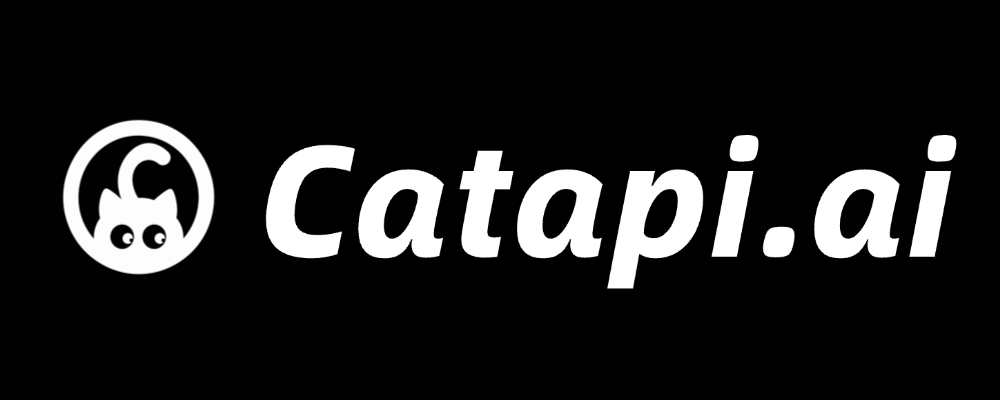
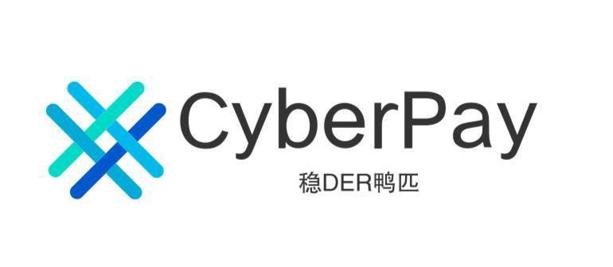

# KorpProxy

English | [中文](README_CN.md) | [日本語](README_JA.md)

**KorpProxy** is a maintained fork of
[router-for-me/CLIProxyAPI](https://github.com/router-for-me/CLIProxyAPI)
bundled with a native **macOS menu-bar app**. The fork tracks upstream's
(near-daily) releases automatically while letting us land core fixes and new
models on our own schedule.

All credit for the underlying proxy engine goes to the upstream
[CLIProxyAPI](https://github.com/router-for-me/CLIProxyAPI) authors and
maintainers. KorpProxy adds the macOS app, automated upstream syncing, and a
self-controlled model catalog on top.

## What the engine does

The engine at the repo root is an exact mirror of upstream's Go proxy server.
It exposes OpenAI / Gemini / Claude / Codex / Grok compatible API endpoints so
you can drive your CLI subscriptions (or API keys) from any compatible client
or SDK:

<<<<<<< HEAD
- OpenAI (including Responses), Gemini, Claude, and Grok compatible endpoints
- OpenAI Codex (GPT models) and Claude Code support via OAuth login
- OAuth credential management with simple CLI authentication flows
- Round-robin load balancing across multiple accounts and keys
  (Gemini, OpenAI, Claude, Codex, Grok)
=======
[](https://www.packyapi.com/register?aff=cliproxyapi)

Thanks to PackyCode for sponsoring this project!

PackyCode is a reliable and efficient API relay service provider, offering relay services for Claude Code, Codex, Gemini, and more.

PackyCode provides special discounts for our software users: register using <a href="https://www.packyapi.com/register?aff=cliproxyapi">this link</a> and enter the "cliproxyapi" promo code during recharge to get 10% off.

---

<table>
<tbody>
<tr>
<td width="180"><a href="https://www.aicodemirror.com/register?invitecode=TJNAIF"></a></td>
<td>Thanks to AICodeMirror for sponsoring this project! AICodeMirror provides official high-stability relay services for Claude Code / Codex / Gemini, with enterprise-grade concurrency, fast invoicing, and 24/7 dedicated technical support. Claude Code / Codex / Gemini official channels at 38% / 2% / 9% of original price, with extra discounts on top-ups! AICodeMirror offers special benefits for CLIProxyAPI users: register via <a href="https://www.aicodemirror.com/register?invitecode=TJNAIF">this link</a> to enjoy 20% off your first top-up, and enterprise customers can get up to 25% off!</td>
</tr>
<tr>
<td width="180"><a href="https://shop.bmoplus.com/?utm_source=github"></a></td>
<td>Huge thanks to BmoPlus for sponsoring this project! BmoPlus is a highly reliable AI account provider built strictly for heavy AI users and developers. They offer rock-solid, ready-to-use accounts and official top-up services for ChatGPT Plus / ChatGPT Pro (Full Warranty) / Claude Pro / Super Grok / Gemini Pro. By registering and ordering through <a href="https://shop.bmoplus.com/?utm_source=github">BmoPlus - Premium AI Accounts & Top-ups</a>, users can unlock the mind-blowing rate of <b>10% of the official GPT subscription price (90% OFF)</b>!</td>
</tr>
<tr>
<td width="180"><a href="https://visioncoder.cn/"></a></td>
<td>Thanks to VisionCoder for supporting this project. <a href="https://visioncoder.cn/">VisionCoder Developer Platform</a> is a reliable and efficient API relay service provider, offering access to mainstream AI models such as Claude Code, Codex, and Gemini. It helps developers and teams integrate AI capabilities more easily and improve productivity. Additionally, VisionCoder now offers retail channels for <b>Claude Max 200 and GPT Pro 200 premium accounts</b>, providing users with instant access to top-tier AI computing power and features.</td>
</tr>
<tr>
<td width="180"><a href="https://apikey.fun/register?aff=CLIProxyAPI"></a></td>
<td>Thanks to APIKEY.FUN for sponsoring this project! APIKEY.FUN is a professional enterprise-grade AI relay platform dedicated to providing stable, efficient, and low-cost AI model API access for enterprises and individual developers. The platform supports popular mainstream models such as Claude, OpenAI, and Gemini, with prices as low as 7% of the official price. Register through this project's <a href="https://apikey.fun/register?aff=CLIProxyAPI">exclusive link</a> to enjoy a special <b>permanent 5% top-up discount</b>.</td>
</tr>
<tr>
<td width="180"><a href="https://runapi.co/register?aff=FivD"></a></td>
<td>RunAPI is an efficient and stable API platform—an alternative to OpenRouter. A single API Key gives you access to 150+ leading models, including OpenAI, Claude, Gemini, DeepSeek, Grok, and more, at prices as low as 10% of the original (up to 90% off), with exceptional stability. It's seamlessly compatible with tools like Claude Code, OpenClaw, and others. RunAPI offers an exclusive perk for CPA users: <a href="https://runapi.co/register?aff=FivD">register</a> and contact an administrator to claim ¥7 in free credit.</td>
</tr>
<tr>
<td width="180"><a href="https://unity2.ai/register?source=cliproxyapi"></a></td>
<td>Thanks to Unity2.ai for sponsoring this project! Unity2.ai is a high-performance AI model API relay platform for individual developers, teams, and enterprises. It has long served leading domestic enterprises, handles more than 30 billion token calls per day, and supports high concurrency at the 5000 RPM level. It supports balance billing, first top-up bonuses, bundled subscriptions, enterprise invoicing, and dedicated integration support. Register through <a href="https://unity2.ai/register?source=cliproxyapi">this link</a> to receive a $2 balance, then join the official group to get another $10 balance, for up to $12 in free credit.</td>
</tr>
<tr>
<td width="180"><a href="https://catapi.ai/sign-up"></a></td>
<td>Cat API is an AI model aggregation platform built for individual developers and teams, integrating leading large language models into a single simple, stable, and easy-to-use entry point. It provides an API fully compatible with OpenAI, Claude, and Gemini that plugs seamlessly into mainstream AI IDEs and coding tools such as Claude Code, Cursor, Windsurf, Cline, Roo Code, Continue, Codex, and Trae, and features dedicated CN2 high-speed routing for low-latency, highly reliable access. <a href="https://catapi.ai/sign-up">Sign up</a> to claim 1$ in free credits.</td>
</tr>
<tr>
<td width="180"><a href="https://t.me/CyberWlD/218"></a></td>
<td>CyberPay was founded in 2021. We are committed to providing stable, efficient, and secure payment settlement solutions for AI industry merchants. Working with us helps your website platform solve Alipay and WeChat payment collection needs. We support business cooperation for selling GPT, Gemini, Claude, and Codex accounts, relay platforms, and other related services, helping merchants address payment collection challenges. <a href="https://t.me/CyberWlD/218">Contact us</a> to start your path to growth.</td>
</tr>
<tr>
<td width="180"><a href="https://console.claudeapi.com/agent/register/pJq9T52Fpugrhpgo"></a></td>
<td>Thanks to <a href="https://console.claudeapi.com/agent/register/pJq9T52Fpugrhpgo">Claude API</a> for sponsoring this project! Claude API is an official-channel API provider focused on Claude models. Built on Anthropic official keys and AWS Bedrock official channels, it provides a stable integration experience for Claude Code and Agent applications, supports the full Claude model family, and preserves official capabilities such as Tool Use and long context. The service is not reverse-engineered and does not downgrade model capabilities, making it suitable for heavy Claude Code users, Agent engineers, and enterprise technical teams. Register through the <a href="https://console.claudeapi.com/agent/register/pJq9T52Fpugrhpgo">Exclusive link</a> and contact customer support to claim free test credits. Invoicing and team onboarding are also supported.</td>
</tr>
<tr>
<td width="180"><a href="https://code0.ai/agent/register/slxVMR3uVBoRgNBf"></a></td>
<td>Thanks to <a href="https://code0.ai/agent/register/slxVMR3uVBoRgNBf">Code0</a> for sponsoring this project! code0.ai is an AI coding workspace for developers and technical teams, bringing together mainstream Agent coding capabilities such as Claude Code and Codex. It supports common development scenarios including code generation, project understanding, debugging, code review, and documentation. It is suitable for independent developers, Agent engineers, open-source maintainers, and enterprise R&D teams, with invoicing and team onboarding supported. Register through the <a href="https://code0.ai/agent/register/slxVMR3uVBoRgNBf">Exclusive link</a> and contact customer support to claim free test credits and experience a more efficient AI coding workflow.</td>
</tr>
<tr>
<td width="180"><a href="https://api.fenno.ai/register?redirect=/purchase?tab=subscription%26group=16&amp;aff=DQFAMNB6CBLY"></a></td>
<td>Thanks to <a href="https://api.fenno.ai/register?redirect=/purchase?tab=subscription%26group=16&amp;aff=DQFAMNB6CBLY">Fenno.ai</a> for sponsoring this project! Fenno.ai is a stable and efficient API relay service provider currently focused on Codex relay services. It is compatible with OpenAI and Anthropic protocols and can flexibly connect to mainstream coding tools such as Codex, Claude Code, and OpenCode. It can reliably support enterprise-grade demand of hundreds of billions of tokens per day, with B2B settlement and invoicing for domestic and overseas entities. Fenno.ai offers an exclusive benefit for CLIProxyAPI users: subscribe to the great-value Coding Plan with <b>9.9 yuan / $150 quota</b> through <a href="https://api.fenno.ai/register?redirect=/purchase?tab=subscription%26group=16&amp;aff=DQFAMNB6CBLY">this link</a>, and invite friends to earn up to 20% rewards.</td>
</tr>
<tr>
<td width="180"><a href="https://s.qiniu.com/7zUJri"></a></td>
<td>Thanks to <a href="https://s.qiniu.com/7zUJri">Qiniu Cloud AI</a> for sponsoring this project! Qiniu Cloud AI is an enterprise-grade large-model MaaS platform under Qiniu Cloud (02567.HK). It provides one-stop access to 150+ mainstream global models, is compatible with protocols from major global model providers, and covers full-modal processing capabilities for text, image, audio, video, and files. It serves more than 1.69 million enterprise and developer users. Exclusive benefits: enterprise users can claim 12 million free tokens, and invite friends to earn up to tens of billions of tokens.</td>
</tr>
</tbody>
</table>

## Overview

- OpenAI/Gemini/Claude/Grok compatible API endpoints for CLI models
- OpenAI Codex support (GPT models) via OAuth login
- Claude Code support via OAuth login
- Grok Build support via OAuth login
>>>>>>> v7.2.55
- Streaming, non-streaming, and WebSocket responses where supported
- Function calling / tools and multimodal (text + image) input
- OpenAI-compatible upstream providers via config (e.g. OpenRouter)
- Generative Language API key support
- Reusable Go SDK for embedding the proxy (see `docs/sdk-usage.md`)

Upstream guides and the Management API reference live at
[https://help.router-for.me/](https://help.router-for.me/).

## macOS app

The `app/` directory holds **KorpProxy.app**, a native SwiftUI menu-bar app
(`MenuBarExtra`) that supervises the Go engine on macOS:

- Launches, stops, restarts, and health-checks the engine process
- Manages engine files under `~/Library/Application Support/KorpProxy/`
  (config.yaml, auths, logs)
- Talks to the engine's `/v0/management` API and shows a live log tail in
  Settings
- Ships Sparkle-based auto-update

The app is unsandboxed (it spawns the engine and binds a local port) and is not
intended for the Mac App Store. See [`app/README.md`](app/README.md) for build
and run details.

## Quick start

### Build & run the engine

```bash
go build -o cli-proxy-api ./cmd/server   # build
go run ./cmd/server                      # run a dev server
```

Common flags: `--config <path>`, `--tui` (terminal UI), `--standalone`,
`--local-model`, `--no-browser`.

### Configure

Copy the example config and edit it:

```bash
cp config.example.yaml config.yaml
```

The server reads `config.yaml` by default (override with `--config`). A `.env`
file in the working directory is auto-loaded, and auth material defaults to
`auths/`. When a config snippet needs an API key, use a placeholder such as
`YOUR_API_KEY` rather than a real secret.

### Docker

```bash
docker compose up -d
```

`docker-compose.yml` maps the engine ports and mounts your `config.yaml`,
`auths/`, and `logs/` into the container. Override paths and the image via the
`CLI_PROXY_CONFIG_PATH`, `CLI_PROXY_AUTH_PATH`, `CLI_PROXY_LOG_PATH`, and
`CLI_PROXY_IMAGE` environment variables.

## Fork specifics

### Automated upstream sync

A GitHub Action (`fork-sync`) runs **every 3 hours** and tracks upstream's
[releases](https://github.com/router-for-me/CLIProxyAPI/releases), merging the
latest published release tag into ours:

| Outcome | What happens |
|---------|--------------|
| Clean merge **and** build + test pass | auto-merges straight to `main` — no PR, no human step |
| Clean merge but build/test **fails** | opens a `sync/upstream-*` PR titled `build/test FAILED` |
| Merge **conflict** | commits the conflicted tree and opens a **draft** PR listing the files |

The steady state is zero manual work; you only get a PR when something needs a
human. For manual syncs use `./scripts/sync-upstream.sh`.

### Self-controlled model catalog (`KORP_MODELS_URL`)

Models are embedded at build time but refreshed from a remote catalog on
startup and every 3 hours — upstream's list by default. KorpProxy adds an
override: set `KORP_MODELS_URL` to one or more comma-separated `models.json`
URL(s) and they're tried first, with upstream kept as fallback.

```bash
export KORP_MODELS_URL=https://example.com/your/models.json
```

`--local-model` disables remote refresh and pins to the embedded list.

See [FORK.md](FORK.md) for the full fork documentation — layout, remotes,
sync automation, core-fix conventions, and the model-catalog schema.

## License

This project is licensed under the MIT License — see the [LICENSE](LICENSE)
file for details.
