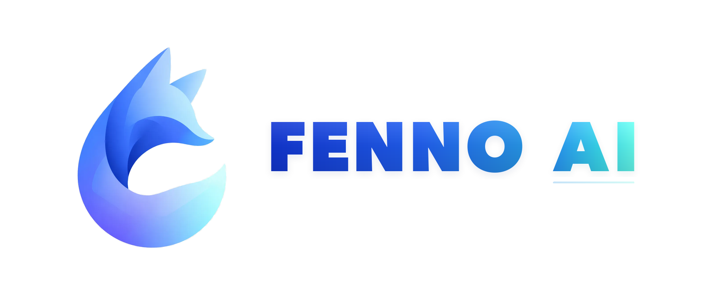
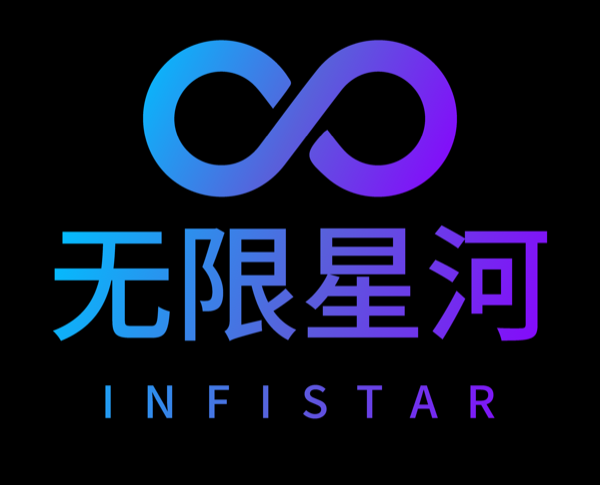

# KorpProxy

English | [中文](README_CN.md) | [日本語](README_JA.md)

**KorpProxy** is a maintained fork of
[router-for-me/CLIProxyAPI](https://github.com/router-for-me/CLIProxyAPI)
bundled with a native **macOS menu-bar app**. The fork tracks upstream's
(near-daily) releases automatically while letting us land core fixes and new
models on our own schedule.

All credit for the underlying proxy engine goes to the upstream
[CLIProxyAPI](https://github.com/router-for-me/CLIProxyAPI) authors and
maintainers. KorpProxy adds the macOS app, automated upstream syncing, and a
self-controlled model catalog on top.

## What the engine does

The engine at the repo root is an exact mirror of upstream's Go proxy server.
It exposes OpenAI / Gemini / Claude / Codex / Grok compatible API endpoints so
you can drive your CLI subscriptions (or API keys) from any compatible client
or SDK:

<<<<<<< HEAD
- OpenAI (including Responses), Gemini, Claude, and Grok compatible endpoints
- OpenAI Codex (GPT models) and Claude Code support via OAuth login
- OAuth credential management with simple CLI authentication flows
- Round-robin load balancing across multiple accounts and keys
  (Gemini, OpenAI, Claude, Codex, Grok)
=======

## Sponsor

[](https://www.packyapi.com/register?aff=cliproxyapi)

Thanks to PackyCode for sponsoring this project!

PackyCode is a reliable and efficient API relay service provider, offering relay services for Claude Code, Codex, Gemini, and more.

PackyCode provides special discounts for our software users: register using <a href="https://www.packyapi.com/register?aff=cliproxyapi">this link</a> and enter the "cliproxyapi" promo code during recharge to get 10% off.

---

<table>
<tbody>
<tr>
<td width="180"><a href="https://www.aicodemirror.ai/register?invitecode=TJNAIF"></a></td>
<td>Thanks to AICodeMirror for sponsoring this project! AICodeMirror provides official high-stability relay services for Claude Code / Codex / Gemini, with enterprise-grade concurrency, fast invoicing, and 24/7 dedicated technical support. Claude Code / Codex / Gemini official channels at 38% / 2% / 9% of original price, with extra discounts on top-ups! AICodeMirror offers special benefits for CLIProxyAPI users: register via <a href="https://www.aicodemirror.ai/register?invitecode=TJNAIF">this link</a> to enjoy 20% off your first top-up, and enterprise customers can get up to 25% off!</td>
</tr>
<tr>
<td width="180"><a href="https://apikey.fun/register?aff=CLIProxyAPI"></a></td>
<td>Thanks to APIKEY.FUN for sponsoring this project! APIKEY.FUN is a professional enterprise-grade AI relay platform dedicated to providing stable, efficient, and low-cost AI model API access for enterprises and individual developers. The platform supports popular mainstream models such as Claude, OpenAI, and Gemini, with prices as low as 7% of the official price. Register through this project's <a href="https://apikey.fun/register?aff=CLIProxyAPI">exclusive link</a> to enjoy a special <b>permanent 5% top-up discount</b>.</td>
</tr>
<tr>
<td width="180"><a href="https://runapi.host/register?aff=FivD"></a></td>
<td>RunAPI is an efficient and stable API platform—an alternative to OpenRouter. A single API Key gives you access to 150+ leading models, including OpenAI, Claude, Gemini, DeepSeek, Grok, and more, at prices as low as 10% of the original (up to 90% off), with exceptional stability. It's seamlessly compatible with tools like Claude Code, OpenClaw, and others. RunAPI offers an exclusive perk for CPA users: <a href="https://runapi.host/register?aff=FivD">register</a> and contact an administrator to claim ¥7 in free credit.</td>
</tr>
<tr>
<td width="180"><a href="https://t.me/CyberWlD/218"></a></td>
<td>CyberPay was founded in 2021. We are committed to providing stable, efficient, and secure payment settlement solutions for AI industry merchants. Working with us helps your website platform solve Alipay and WeChat payment collection needs. We support business cooperation for selling GPT, Gemini, Claude, and Codex accounts, relay platforms, and other related services, helping merchants address payment collection challenges. <a href="https://t.me/CyberWlD/218">Contact us</a> to start your path to growth.</td>
</tr>
<tr>
<td width="180"><a href="https://api.fenno.ai/s/Cvf0"></a></td>
<td>FennoAI is a stable and efficient API relay service provider, currently focused on Codex relay services. It is compatible with OpenAI and Anthropic protocols and can flexibly integrate with mainstream coding tools such as Codex, Claude Code, and OpenCode. It can reliably support enterprise-grade demand of hundreds of billions of tokens per day, with B2B settlement and invoicing available for both domestic and overseas entities. FennoAI offers an exclusive benefit for CLIProxyAPI users: purchase a subscription through the <a href="https://api.fenno.ai/s/Cvf0">exclusive link</a> and receive $50 worth of Coding Plan credits for just $1.99. Referral rewards are also available: earn up to 20% commission when invited friends make a purchase. The more friends you invite, the greater the rewards.</td>
</tr>
<tr>
<td width="180"><a href="https://s.qiniu.com/7zUJri"></a></td>
<td>Thanks to <a href="https://s.qiniu.com/7zUJri">Qiniu Cloud AI</a> for sponsoring this project! Qiniu Cloud AI is an enterprise-grade large-model MaaS platform under Qiniu Cloud (02567.HK). It provides one-stop access to 150+ mainstream global models, is compatible with protocols from major global model providers, and covers full-modal processing capabilities for text, image, audio, video, and files. It serves more than 1.69 million enterprise and developer users. Exclusive benefits: enterprise users can claim 12 million free tokens, and invite friends to earn up to tens of billions of tokens.</td>
</tr>
<tr>
<td width="180"><a href="https://cubence.com/signup?code=CLIPROXYAPI&source=cpa"></a></td>
<td>Thanks to Cubence for sponsoring this project! Cubence is a reliable and efficient API relay service provider, offering relay services for Claude Code, Codex, Gemini, and more. Cubence provides special discounts for our software users: register using <a href="https://cubence.com/signup?code=CLIPROXYAPI&source=cpa">this link</a> and enter the "CLIPROXYAPI" promo code during recharge to get 10% off.</td>
</tr>
<tr>
<td width="180"><a href="https://www.fastaitoken.com/"></a></td>
<td>Thanks to <a href="https://www.fastaitoken.com/">FastAIToken</a> for sponsoring this project! FastAIToken is an AI API aggregation platform built for developers, focused on speed and stability. It supports leading AI models including OpenAI, Claude, Gemini, and more. With a 1:1 recharge ratio (¥1 = $1 in API credits), developers can access the world's top AI models at lower cost and with greater convenience. <a href="https://t.me/+stwq0MLi0PtkZTZl">Telegram Support Group</a><br/>The platform offers multiple channels to suit different needs: an ultra-low-cost 0.02× OpenAI promotional tier (limited time), OpenAI channels starting from 0.25×, 0.7× Claude with 95% fixed cache, and 1.2× Claude Max channels. It also provides a public status page displaying real-time availability, latency, and operational status for every channel, ensuring transparent and reliable service. In addition, FastAIToken offers 24/7 human technical support (no bots) for rapid response to developers' needs. For enterprise customers, dedicated SLA-backed channel pools are available with guaranteed stability, contract support, invoicing, and dedicated maintenance.</td>
</tr>
<tr>
<td width="180"><a href="https://www.infistar.cc/register?aff=FQKC6J6R&ref_source=link"></a></td>
<td>Worried about diluted or downgraded models, or opaque pricing? Infistar.ai, a globally leading model aggregation service, verifies every model it offers through real API calls. Its supply comes from official APIs and official account pools, with load balancing across more than 10,000 supply routes to ensure low latency and stability during peak periods. It covers leading models worldwide, including ChatGPT, Claude, Gemini, Grok, GLM, DeepSeek, Kimi, Qwen, and MiniMax, with full-modal capabilities spanning text, video, images, embeddings, reranking, and more. Pricing and usage are transparent, clear, and easy to inspect, with models available from as little as 10% of official prices. CLIProxyAPI users can register and try the service through the exclusive entry. Invitation link: <a href="https://www.infistar.cc/register?aff=FQKC6J6R&ref_source=link">https://www.infistar.cc/register?aff=FQKC6J6R&ref_source=link</a></td>
</tr>
<tr>
<td width="180"><a href="https://bestproxy.com/?keyword=ayh7otlb"></a></td>
<td>Bestproxy provides high-purity residential IPs with dedicated one-IP-per-account support. 🟡Residential Proxy - &#36;0.5/GB；🟡Static Residential Proxy - Starting at &#36;3/IP；🟡Unlimited Residential Proxy - Starting at &#36;67/Day.  ✅<a href="https://bestproxy.com/?keyword=ayh7otlb">Get Free Trial.</a></td>
</tr>
<tr>
<td width="180"><a href="https://go.apimart.ai/gh-cliproxyapi"></a></td>
<td>Thanks to APIMart for sponsoring this project! APIMart is a low-cost API platform for AI image &amp; video generation — GPT-Image-2 from &#36;0.006/image, 160+ images per dollar. One async API covers both image and video: submit a task, get an ID, fetch results via polling or callback. Batch tens of thousands of images without timeouts, switch models without changing code. Pay-as-you-go with no monthly fee — <a href="https://go.apimart.ai/gh-cliproxyapi">sign up here</a> to get started.</td>
</tr>
<tr>
<td width="180"><a href="https://www.axisnow.io/zh"></a></td>
<td>Protect and accelerate websites and APIs while optimizing access from both mainland China and the rest of the world. Extend acceleration and security to native and mobile apps through client SDKs — <b>self-hosted private CDN | subscription-based DDoS-protected CDN | independently controlled, flexibly composable CDN networks.</b></td>
</tr>
<tr>
<td width="180"><a href="https://www.swiftproxy.net/?code=PR67S9A95"></a></td>
<td>Swiftproxy provides 90M+ clean residential IPs across 220+ locations, supporting HTTP(S)/SOCKS5, IP rotation, Sticky Sessions, and precise location targeting. It helps AI API tools and automation workflows access online services reliably from different locations, making it ideal for API requests, web access, data collection, and location-based testing. Residential proxies from &#36;0.7/GB. Free testing is available, with 10% off using code PROXY90. <a href="https://www.swiftproxy.net/?code=PR67S9A95">Try Swiftproxy Now</a></td>
</tr>
</tbody>
</table>

## Overview

- OpenAI/Gemini/Claude/Grok compatible API endpoints for CLI models
- OpenAI Codex support (GPT models) via OAuth login
- Claude Code support via OAuth login
- Grok Build support via OAuth login
>>>>>>> v7.2.151
- Streaming, non-streaming, and WebSocket responses where supported
- Function calling / tools and multimodal (text + image) input
- OpenAI-compatible upstream providers via config (e.g. OpenRouter)
- Generative Language API key support
- Reusable Go SDK for embedding the proxy (see `docs/sdk-usage.md`)

Upstream guides and the Management API reference live at
[https://help.router-for.me/](https://help.router-for.me/).

## macOS app

The `app/` directory holds **KorpProxy.app**, a native SwiftUI menu-bar app
(`MenuBarExtra`) that supervises the Go engine on macOS:

- Launches, stops, restarts, and health-checks the engine process
- Manages engine files under `~/Library/Application Support/KorpProxy/`
  (config.yaml, auths, logs)
- Talks to the engine's `/v0/management` API and shows a live log tail in
  Settings
- Ships Sparkle-based auto-update

The app is unsandboxed (it spawns the engine and binds a local port) and is not
intended for the Mac App Store. See [`app/README.md`](app/README.md) for build
and run details.

## Quick start

### Build & run the engine

```bash
go build -o cli-proxy-api ./cmd/server   # build
go run ./cmd/server                      # run a dev server
```

Common flags: `--config <path>`, `--tui` (terminal UI), `--standalone`,
`--local-model`, `--no-browser`.

### Configure

Copy the example config and edit it:

```bash
cp config.example.yaml config.yaml
```

The server reads `config.yaml` by default (override with `--config`). A `.env`
file in the working directory is auto-loaded, and auth material defaults to
`auths/`. When a config snippet needs an API key, use a placeholder such as
`YOUR_API_KEY` rather than a real secret.

### Docker

```bash
docker compose up -d
```

`docker-compose.yml` maps the engine ports and mounts your `config.yaml`,
`auths/`, and `logs/` into the container. Override paths and the image via the
`CLI_PROXY_CONFIG_PATH`, `CLI_PROXY_AUTH_PATH`, `CLI_PROXY_LOG_PATH`, and
`CLI_PROXY_IMAGE` environment variables.

## Fork specifics

### Automated upstream sync

A GitHub Action (`fork-sync`) runs **every 3 hours** and tracks upstream's
[releases](https://github.com/router-for-me/CLIProxyAPI/releases), merging the
latest published release tag into ours:

| Outcome | What happens |
|---------|--------------|
| Clean merge **and** build + test pass | auto-merges straight to `main` — no PR, no human step |
| Clean merge but build/test **fails** | opens a `sync/upstream-*` PR titled `build/test FAILED` |
| Merge **conflict** | commits the conflicted tree and opens a **draft** PR listing the files |

The steady state is zero manual work; you only get a PR when something needs a
human. For manual syncs use `./scripts/sync-upstream.sh`.

### Self-controlled model catalog (`KORP_MODELS_URL`)

Models are embedded at build time but refreshed from a remote catalog on
startup and every 3 hours — upstream's list by default. KorpProxy adds an
override: set `KORP_MODELS_URL` to one or more comma-separated `models.json`
URL(s) and they're tried first, with upstream kept as fallback.

```bash
export KORP_MODELS_URL=https://example.com/your/models.json
```

`--local-model` disables remote refresh and pins to the embedded list.

<<<<<<< HEAD
See [FORK.md](FORK.md) for the full fork documentation — layout, remotes,
sync automation, core-fix conventions, and the model-catalog schema.
=======
### [ProxyPilot](https://github.com/Finesssee/ProxyPilot)

Windows-native CLIProxyAPI fork with TUI, system tray, and multi-provider OAuth for AI coding tools - no API keys needed.

### [Claude Proxy VSCode](https://github.com/uzhao/claude-proxy-vscode)

VSCode extension for quick switching between Claude Code models, featuring integrated CLIProxyAPI as its backend with automatic background lifecycle management.

### [ZeroLimit](https://github.com/0xtbug/zero-limit)

Windows desktop app built with Tauri + React for monitoring AI coding assistant quotas via CLIProxyAPI. Track usage across Gemini, Claude, OpenAI Codex, and Antigravity accounts with real-time dashboard, system tray integration, and one-click proxy control - no API keys needed.

### [CPA-XXX Panel](https://github.com/ferretgeek/CPA-X)

A lightweight web admin panel for CLIProxyAPI with health checks, resource monitoring, real-time logs, auto-update, request statistics and pricing display. Supports one-click installation and systemd service.

### [CLIProxyAPI Tray](https://github.com/kitephp/CLIProxyAPI_Tray)

A Windows tray application implemented using PowerShell scripts, without relying on any third-party libraries. The main features include: automatic creation of shortcuts, silent running, password management, channel switching (Main / Plus), and automatic downloading and updating.

### [霖君](https://github.com/wangdabaoqq/LinJun)

霖君 is a cross-platform desktop application for managing AI programming assistants, supporting macOS, Windows, and Linux systems. Unified management of Claude Code, Gemini, OpenAI Codex, and other AI coding tools, with local proxy for multi-account quota tracking and one-click configuration.

### [CLIProxyAPI Dashboard](https://github.com/itsmylife44/cliproxyapi-dashboard)

A modern web-based management dashboard for CLIProxyAPI built with Next.js, React, and PostgreSQL. Features real-time log streaming, structured configuration editing, API key management, OAuth provider integration for Claude/Gemini/Codex, usage analytics, container management, and config sync with OpenCode via companion plugin - no manual YAML editing needed.

### [All API Hub](https://github.com/qixing-jk/all-api-hub)

Browser extension for one-stop management of New API-compatible relay site accounts, featuring balance and usage dashboards, auto check-in, one-click key export to common apps, in-page API availability testing, and channel/model sync and redirection. It integrates with CLIProxyAPI through the Management API for one-click provider import and config sync.

### [Shadow AI](https://github.com/HEUDavid/shadow-ai)

Shadow AI is an AI assistant tool designed specifically for restricted environments. It provides a stealthy operation
mode without windows or traces, and enables cross-device AI Q&A interaction and control via the local area network (
LAN). Essentially, it is an automated collaboration layer of "screen/audio capture + AI inference + low-friction delivery",
helping users to immersively use AI assistants across applications on controlled devices or in restricted environments.

### [ProxyPal](https://github.com/buddingnewinsights/proxypal)

Cross-platform desktop app (macOS, Windows, Linux) wrapping CLIProxyAPI with a native GUI. Connects Claude, ChatGPT, Gemini, GitHub Copilot, and custom OpenAI-compatible endpoints with usage analytics, request monitoring, and auto-configuration for popular coding tools - no API keys needed.

### [CLIProxyAPI Quota Inspector](https://github.com/AllenReder/CLIProxyAPI-Quota-Inspector)

Ready-to-use cross-platform quota inspector for CLIProxyAPI, supporting per-account codex 5h/7d quota windows, plan-based sorting, status coloring, and multi-account summary analytics.

### [CLIProxy Pool Watch](https://github.com/murasame612/CLIProxyPoolWidget)

Native macOS SwiftUI app for monitoring ChatGPT/Codex account quotas in CLIProxyAPI pools. Displays account availability, Plus-base capacity, 5-hour and weekly quota bars, plan weights, and restore forecasts through the Management API.

### [Panopticon](https://github.com/eltmon/panopticon-cli)

Multi-agent orchestration for AI coding assistants. Runs CLIProxyAPI as a local sidecar so its agents can drive GPT models through a ChatGPT subscription, pointing Claude Code at an Anthropic-compatible endpoint with no OpenAI API key required.

### [Tunnel Agent](https://github.com/Villoh/tunnel-agent)

Windows desktop UI that manages CLIProxyAPI and Perplexity WebUI Scraper from a single interface, inspired by Quotio and VibeProxy. Connect OAuth providers (Claude, Gemini, Codex, Kimi, Antigravity), custom API keys, and Perplexity session accounts, then point any coding agent at the local endpoint.

### [Quotio Desktop](https://github.com/xiaocoss/quotio-desktop)

Cross-platform (Tauri) port of Quotio for Windows, macOS and Linux. Manages a pool of AI accounts (Codex, Claude Code, GitHub Copilot, Gemini, Antigravity, Kiro, Cursor, Trae, GLM) through CLIProxyAPI, with per-account 5-hour/weekly quota bars, Codex rate-limit reset credits with one-click reset, smart scheduling, usage statistics, and multi-instance Codex — no API keys needed.

### [Universal Chat Provider](https://github.com/maxdewald/vscode-universal-chat-provider)

VS Code extension that brings your Claude, ChatGPT/Codex, Antigravity, Grok, and Kimi subscriptions into GitHub Copilot Chat as native language models — and can power your Git commit messages, chat titles, and summaries too. Runs CLIProxyAPI in a fully managed background lifecycle (download, verify, supervise) shared across all windows, so it's zero-setup. No API keys needed, just OAuth.

### [CPA-Tray-Powershell](https://github.com/IQ-Director/CPA-Tray-Powershell)

A PowerShell-based Windows system tray launcher for CLIProxyAPI. It supports running in the background without a console window, opening the management page, keeping the backend running after the management window closes, and reopening the page from the tray. It also supports checking for CLIProxyAPI updates on startup, SHA-256 verification with rollback, one-click CLIProxyAPI restart and update, PID-validated process management, and safe service shutdown.

### [Grok Search MCP](https://github.com/MapleMapleCat/Grok_Search_Mcp)

An HTTP-only Model Context Protocol server that uses a CLIProxyAPI deployment to provide Grok-powered real-time web search, X/Twitter search, and model discovery to MCP clients. It adds MCP transport, client API-key management, quotas, usage tracking, and a web administration panel.

### [AIUsage](https://github.com/sylearn/AIUsage)

Native macOS SwiftUI dashboard for AI subscriptions and coding proxies. It manages official CLIProxyAPI releases end to end (download, verify, supervise, update, and roll back), unifies OAuth accounts and live models, and connects one gateway to Codex, Claude Code/Science, OpenCode, or OpenAI/Anthropic/Gemini clients, with optional LAN access.

### [Claude Dialects](https://github.com/stefandevo/claude-dialects)

Run multiple native-feeling Claude Code commands, each powered by a different model (Codex, GLM, Kimi, Gemini, Grok, MiniMax, DeepSeek, Cursor, Copilot, Claude). Every dialect launches the real Claude Code interface with its own isolated config, history, ports, and an embedded CLIProxyAPI instance linked through the Go SDK — no separate proxy install. macOS only. Learn more at [claude-dialects.cc](https://claude-dialects.cc/).

### [WebBrain](https://github.com/webbrain-one/webbrain)

Browser agent that can connect to CLIProxyAPI's local OpenAI-compatible endpoint as a model provider. See WebBrain's independent [setup, security, and account-risk guide](https://webbrain.one/docs/easy-cli-proxy/) for using CLIProxyAPI through EasyCLIProxyAPI.

### [Infinitus](https://github.com/deathemperor/infinitus)

Native macOS menu bar app that runs a fleet of Claude accounts through CLIProxyAPI's Management API (claude-swap and 9Router too): 5h / 7d / per-model quota gauges, switch / hold / star from the popup, a run-rate forecast of when each window runs out, and an iPhone companion that mirrors it all - no API keys needed.

> [!NOTE]  
> If you developed a project based on CLIProxyAPI, please open a PR to add it to this list.

## More choices

Those projects are ports of CLIProxyAPI or inspired by it:

### [9Router](https://github.com/decolua/9router)

A Next.js implementation inspired by CLIProxyAPI, easy to install and use, built from scratch with format translation (OpenAI/Claude/Gemini/Ollama), combo system with auto-fallback, multi-account management with exponential backoff, a Next.js web dashboard, and support for CLI tools (Cursor, Claude Code, Cline, RooCode) - no API keys needed.

### [OmniRoute](https://github.com/diegosouzapw/OmniRoute)

Never stop coding. Smart routing to FREE & low-cost AI models with automatic fallback.

OmniRoute is an AI gateway for multi-provider LLMs: an OpenAI-compatible endpoint with smart routing, load balancing, retries, and fallbacks. Add policies, rate limits, caching, and observability for reliable, cost-aware inference.

### [Codex Switch](https://github.com/9ycrooked/CodexSwitch)

This is a tool built with Tauri 2 + Vue 3 for managing multiple OpenAI Codex desktop accounts. Switch between saved ChatGPT/Codex certification profiles, check 5-hour and weekly quota usage in real time, verify token health, view active account details, and import or save auth.json files without manual copying.

> [!NOTE]  
> If you have developed a port of CLIProxyAPI or a project inspired by it, please open a PR to add it to this list.
>>>>>>> v7.2.151

## License

This project is licensed under the MIT License — see the [LICENSE](LICENSE)
file for details.
